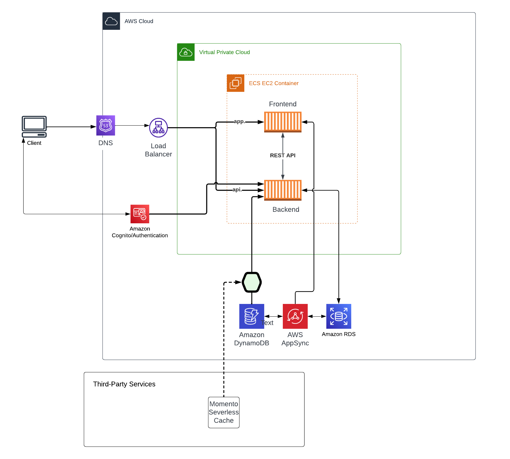

# Week 0 — Billing and Architecture

## Required Tasks

### Install AWS CLI

I used gitpod to install my AWS CLI. I am providing the instructions I used for my configuration of my local machine on Windows.

I did the following steps to install AWS CLI.

I followed the instructions on the [AWS CLI Install Documentation Page](https://docs.aws.amazon.com/cli/latest/userguide/getting-started-install.html)

I installed the AWS CLI for Windows 10 via command in **Command Prompt**:

```
msiexec.exe /i https://awscli.amazonaws.com/AWSCLIV2.msi
```

I was able to set my AWS CLI credentials using the command 
```
aws configure
```


### Logical Architecture


